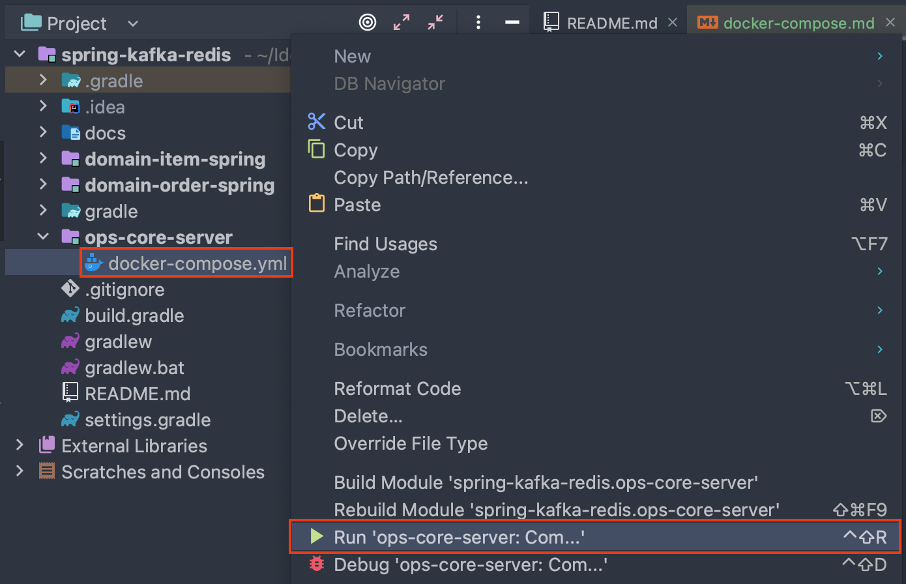
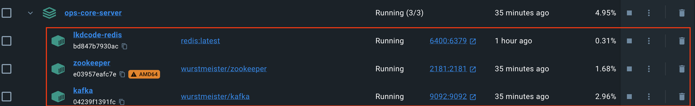
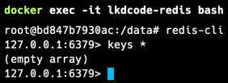
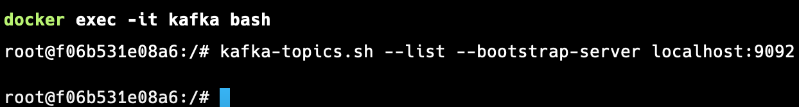

# 🐳 docker-compose

## Docker 설치하기

Docker 와 DockerDesktop 을 설치한다.

## 실행하기

```shell
$ docker-compose up
```



## 결과

```shell
$ docker ps
```



## Redis CLI 접속

```shell
$ docker exec -it lkdcode-redis bash
$ redis-cli
$ keys *
```



## Kafak CLI 접속

```shell
$ docker exec -it kafka bash
$ kafka-topics.sh --list --bootstrap-server localhost:9092
```

